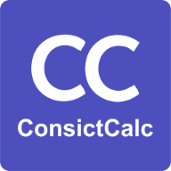

# ConsistCalc - Trading Discipline & Growth Tracker



**ConsistCalc** adalah aplikasi web Trading Discipline & Growth Tracker yang dirancang untuk membantu trader prop firm mengelola, memantau, dan mengevaluasi aktivitas trading dengan fokus pada disiplin dan manajemen risiko.

## Fitur Utama

- **Manajemen Risiko Berlapis**: Perlindungan risiko dengan 3 lapisan (Risk Trading, Daily Loss, Max Loss)
- **Pelacakan Konsistensi**: Memastikan profit trading terdistribusi merata
- **Statistik Real-time**: Metrik kinerja dan analisis performa trading
- **Laporan PDF**: Export data trading dalam format profesional
- **Dukungan Multi-Mata Uang**: USD, IDR, EUR, GBP, JPY, dan lainnya
- **Mode Gelap/Terang**: Tampilan yang nyaman di berbagai kondisi pencahayaan
- **Bilingual**: Dukungan Bahasa Indonesia dan English

## Cara Menjalankan Aplikasi

### Metode 1: Langsung di Browser (Disarankan)

1. Download semua file proyek dari repository ini
2. Simpan semua file dalam satu folder yang sama
3. Buka file `consistcalc.html` di browser (Chrome, Firefox, Edge, Safari)
4. Aplikasi siap digunakan!

### Metode 2: Local Server (Untuk pengembangan)

```bash
# Menggunakan Python
python -m http.server 8000

# Menggunakan Node.js (如果有安装)
npx serve
```

Buka `http://localhost:8000` atau `http://localhost:3000` di browser.

## Konfigurasi Awal

1. Buka aplikasi ConsistCalc
2. Pada section **DATABASE**, configure parameter berikut:
   - **Currency**: Mata uang yang Anda gunakan
   - **Account Balance**: Saldo awal akun trading
   - **Target %**: Target profit bulanan (misal: 8%)
   - **Max Loss % (total)**: Batas kerugian total yang diizinkan
   - **Daily Loss %**: Batas kerugian harian
   - **Risk Trading %**: Batas risk per trade
   - **Consistency Rule %**: Aturan konsistensi profit
3. Klik tombol **SAVE** untuk menyimpan konfigurasi

## FAQ (Pertanyaan yang Sering Diajukan)

### 1. Apa itu ConsistCalc?

ConsistCalc adalah aplikasi Trading Discipline & Growth Tracker yang dirancang untuk membantu trader prop firm mengelola, memantau, dan mengevaluasi aktivitas trading dengan fokus pada disiplin dan manajemen risiko.

### 2. Siapa yang cocok menggunakan ConsistCalc?

ConsistCalc sangat cocok untuk:
- **Trader Prop Firm**: Yang perlu mematuhi aturan trading prop firm
- **Trader Pemula**: Yang sedang belajar manajemen risiko
- **Trader Profesional**: Yang ingin memantau performa trading secara detail

### 3. Apa saja lapisan perlindungan risiko di ConsistCalc?

Tiga lapisan perlindungan risiko:

1. **Risk Trading** - Peringatan jika loss per trade melebihi batas yang ditetapkan
2. **Daily Loss** - Batas kerugian harian yang reset setiap hari Sydney
3. **Max Loss** - Batas kerugian total yang bersifat floating

### 4. Apa itu Daily Loss dan bagaimana cara kerjanya?

**Daily Loss** adalah batas kerugian harian yang dihitung dari saldo pembukaan hari tersebut. Batas ini reset otomatis setiap pergantian hari trading berdasarkan zona waktu Sydney (sekitar pukul 00:00 waktu Sydney).

Contoh: Jika saldo pembukaan Anda $1000 dan Daily Loss % = 2%, maka batas kerugian harian Anda adalah $20.

### 5. Apa itu Max Loss dan bagaimana cara kerjanya?

**Max Loss** adalah batas kerugian total yang bersifat floating (mengambang), mengikuti saldo berjalan. Berbeda dengan Daily Loss:

- Jika trader **profit**, batas kerugian akan **naik**
- Jika trader **loss**, batas kerugian akan **turun**
- Batas ini **tidak pernah reset** sampai trader mencapai target

### 6. Mengapa menggunakan zona waktu Sydney?

Zona waktu Sydney (Australia/Sydney, GMT+11 atau GMT+10 tergantung musim) digunakan karena:

- Mengikuti standar industri prop firm global
- Market Sydney merepresentasikan awal dari siklus trading 24 jam
- Reset terjadi sekitar pukul 00:00 waktu Sydney, yang merupakan waktu yang wajar untuk evaluasi harian

### 7. Apa itu aturan konsistensi?

**Aturan Konsistensi** memastikan profit trading terdistribusi merata, tidak bergantung pada satu atau dua trade "beruntungan". Dihitung dengan formula:

```
(Kan profit tertinggi dalam satu hari / Total net profit) × 100%
```

Contoh: Jika total net profit Anda $100, dan profit tertinggi dalam satu hari adalah $30, maka konsistensi Anda adalah 30%. Jika aturan konsistensi ditetapkan 20%, maka Anda dianggap tidak konsisten.

### 8. Bagaimana cara backup data?

Data trading disimpan otomatis di browser melalui **localStorage**. Untuk backup manual:

1. Gunakan fitur **SAVE AS PDF** untuk menghasilkan laporan lengkap
2. Catat semua pengaturan di section DATABASE
3. Data dapat dipindahkan dengan mencatat pengaturan dan memasukkan ulang di browser lain

### 9. Apakah data aman?

- Data tersimpan secara lokal di browser Anda (localStorage)
- Tidak ada data yang dikirim ke server manapun
- Anda dapat mengekspor data ke PDF untuk backup

### 10. Apakah aplikasi ini gratis?

Ya, ConsistCalc adalah aplikasi **open-source** dan gratis untuk digunakan. Lisensi MIT.

---

## Dukungan Bahasa

Aplikasi ini mendukung 2 bahasa:
- 🇮🇩 **Bahasa Indonesia** (Default)
- 🇺🇸 **English**

Switch bahasa melalui tombol di header aplikasi.

---

## Teknologi yang Digunakan

- **HTML5** - Struktur aplikasi
- **CSS3** - Styling dengan CSS Variables
- **JavaScript (ES6+)** - Logika aplikasi
- **localStorage** - Penyimpanan data lokal
- **jsPDF** - Generasi laporan PDF
- **html2canvas** - Konversi tampilan ke gambar

---

## Kontribusi

Silakan fork repository ini dan buat pull request untuk kontribusi.

---

## Lisensi

MIT License - lihat file [LICENSE](LICENSE.txt) untuk detail.

---

## Kontak

- GitHub: [Repository ConsistCalc]
- Email: support@consistcalc.app

---

**Trading dengan bijak. Konsistensi adalah kunci sukses.**
